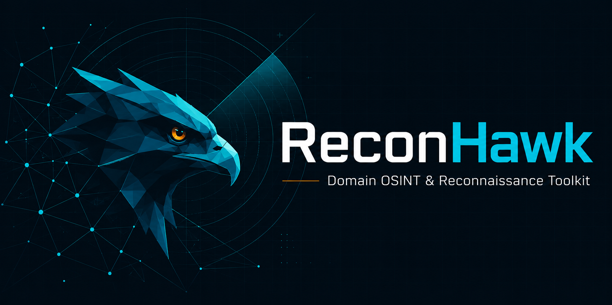
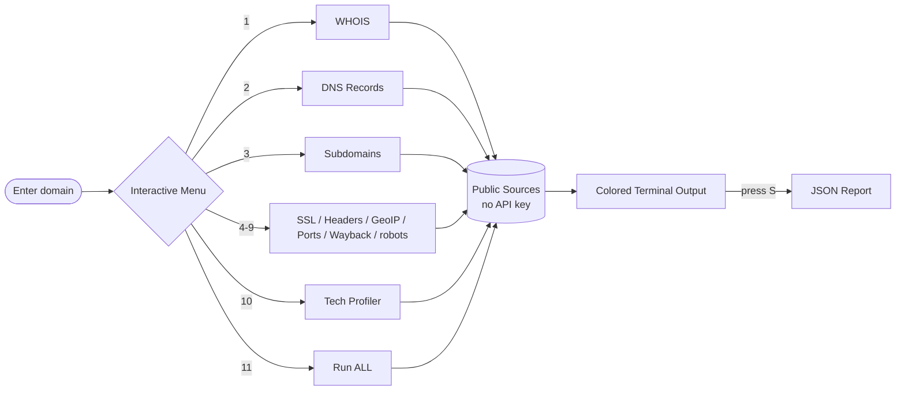

<div align="center">



<br><br>

*Profile any domain from a single interactive menu — WHOIS, DNS, subdomains, SSL, tech-stack and more.*
**100% free · No API key required.**

<br>


<br>

[](https://github.com/Krish-Patwa01/ReconHawk/stargazers)
[](https://github.com/Krish-Patwa01/ReconHawk/network/members)

</div>

---

> [!WARNING]
> **Ethical use only.** Run ReconHawk only on domains you **own** or are **explicitly authorized** to test. You are responsible for how you use this tool.

---

## 📖 Table of Contents

- [✨ Features](#-features)
- [🎬 Sample Output](#-sample-output)
- [🔍 How It Works](#-how-it-works)
- [🚀 Installation](#-installation)
- [🧭 Usage](#-usage)
- [📦 Module Details](#-module-details)
- [💾 Output & Reporting](#-output--reporting)
- [🛠️ Tech Stack](#️-tech-stack)
- [👤 Author](#-author)

---

## ✨ Features

Pick a number from the menu, or hit **`[11]`** to run everything at once. 🔥

| # | Module | What it does |
|:-:|--------|--------------|
| 1️⃣ | **WHOIS Lookup** | Registrar, IANA ID, abuse contacts, registrant details, status, DNSSEC, dates |
| 2️⃣ | **DNS Records** | A, AAAA, CNAME, MX, NS, SOA, TXT, SRV, CAA, DS, DNSKEY + PTR (reverse) |
| 3️⃣ | **Subdomain Enumeration** | Merges **4 sources** (crt.sh, HackerTarget, CertSpotter, OTX) — resilient if one is down |
| 4️⃣ | **SSL / TLS Certificate** | Issuer, validity, days-to-expiry, SANs, TLS version |
| 5️⃣ | **HTTP Security Headers** | Audits HSTS, CSP, X-Frame-Options and more |
| 6️⃣ | **IP Geolocation** | Country, city, ISP, ASN, reverse DNS |
| 7️⃣ | **Port Scan** | Threaded scan of 20 common ports |
| 8️⃣ | **Wayback Machine** | Latest snapshot + total capture count from archive.org |
| 9️⃣ | **robots.txt / sitemap** | Disallowed paths and listed sitemaps |
| 🔟 | **Technology Profiler** | Wappalyzer-style fingerprinting: CMS, JS frameworks, servers, CDN, analytics + versions |

<div align="center">

**`[S]`** save to JSON &nbsp;·&nbsp; **`[T]`** change target &nbsp;·&nbsp; **`[0]`** exit

</div>

---

## 🎬 Sample Output

```text
   ____                       _   _                _
  |  _ \ ___  ___ ___  _ __  | | | | __ ___      _| | __
  | |_) / _ \/ __/ _ \| '_ \ | |_| |/ _` \ \ /\ / / |/ /
  |  _ <  __/ (_| (_) | | | ||  _  | (_| |\ V  V /|   <
  |_| \_\___|\___\___/|_| |_||_| |_|\__,_| \_/\_/ |_|\_\
  All-in-One Domain OSINT & Reconnaissance Toolkit - no API key needed

==[ Subdomain Enumeration ]=========================
  + crt.sh: 43 found
  + HackerTarget: 38 found
  + CertSpotter: 35 found
  --- 44 unique subdomains ---
  - sub: mail.example.com
  - sub: blog.example.com

==[ Technology Profiler ]===========================
  + Meta generator: WordPress 7.1
  --- Web server ---
  + Nginx
  --- Analytics ---
  + Google Tag Manager
```

> 💡 *Tip: drop a screenshot or demo GIF here — `` — to boost the repo's appeal.*

---

## 🔍 How It Works



Every module queries only **public, free sources** — certificate transparency logs, public WHOIS/DNS, archive.org, and the target's own HTTP responses. Nothing intrusive, nothing paywalled.

---

## 🚀 Installation

```bash
# 1. Clone
git clone https://github.com/Krish-Patwa01/ReconHawk.git
cd ReconHawk

# 2. Install dependencies
pip install -r requirements.txt

# 3. Run
python reconhawk.py
```

> **Requirements:** Python 3.8+ · On Windows you can also just double-click **`reconhawk.bat`**.

---

## 🧭 Usage

```bash
python reconhawk.py                # asks for the target, then shows the menu
python reconhawk.py example.com    # pre-fills the target
```

Then just type a number and press Enter. That's it. 🎯

---

## 📦 Module Details

<details>
<summary><b>1 · WHOIS Lookup</b></summary>

<br>

Pulls the full registration record: registrar + IANA ID, abuse contact email/phone, registrant name & address, domain status codes, DNSSEC state, and creation / update / expiry dates. Combines structured `python-whois` fields with raw-text parsing for details the library misses.

</details>

<details>
<summary><b>2 · DNS Records</b></summary>

<br>

Resolves **11 record types** — `A`, `AAAA`, `CNAME`, `MX`, `NS`, `SOA`, `TXT`, `SRV`, `CAA`, `DS`, `DNSKEY` — plus a **PTR reverse lookup** on each resolved IP (works for both IPv4 and IPv6).

</details>

<details>
<summary><b>3 · Subdomain Enumeration</b></summary>

<br>

Queries **4 free sources in parallel** and merges + de-duplicates the results:

- 🔹 **crt.sh** — certificate transparency logs (with automatic retries)
- 🔹 **HackerTarget** — hostsearch API
- 🔹 **CertSpotter** — certificate issuances
- 🔹 **AlienVault OTX** — passive DNS

If one source is slow, down, or rate-limited, the others still deliver results.

</details>

<details>
<summary><b>4 · SSL / TLS Certificate</b></summary>

<br>

Connects over TLS and reports the subject CN, issuer, negotiated TLS version, validity window, **days-to-expiry** (with warnings), and all Subject Alternative Names.

</details>

<details>
<summary><b>5 · HTTP Security Headers</b></summary>

<br>

Checks for six key security headers — **HSTS, CSP, X-Frame-Options, X-Content-Type-Options, Referrer-Policy, Permissions-Policy** — and flags the missing ones. Also surfaces `Server` and `X-Powered-By`.

</details>

<details>
<summary><b>6-10 · GeoIP · Ports · Wayback · robots · Tech Profiler</b></summary>

<br>

- **IP Geolocation** — country, city, ISP, ASN, reverse DNS (via free `ip-api.com`)
- **Port Scan** — threaded scan of 20 common ports (FTP, SSH, HTTP, MySQL, RDP…)
- **Wayback Machine** — latest snapshot + total historical capture count
- **robots.txt / sitemap** — disallowed paths and discovered sitemaps
- **Technology Profiler** — ~50 fingerprints across CMS, JS frameworks, UI libraries, web servers, backend languages, CDN/hosting, and analytics — with version detection where possible

</details>

---

## 💾 Output & Reporting

All results print to the terminal in a clean, **lightly-colored** layout (green ✓, cyan info, yellow warnings, red errors — data stays plain for readability).

Press **`S`** anytime to save everything gathered so far to a timestamped JSON file:

```
reconhawk_example.com_20260718_005131.json
```

Perfect for reports, diffing over time, or feeding into other tools. 📊

---

## 🛠️ Tech Stack

<div align="center">


</div>

Built with the Python standard library (`socket`, `ssl`, `concurrent.futures`) plus three light dependencies: **requests**, **dnspython**, and **python-whois**.

---

## 🏷️ Suggested GitHub Topics

```
osint · reconnaissance · recon · cybersecurity · pentesting · whois · dns
subdomain-enumeration · information-gathering · security-tools · wappalyzer · python
```

---

## 🤝 Contributing

Contributions, ideas, and new fingerprints are welcome! Feel free to open an [issue](https://github.com/Krish-Patwa01/ReconHawk/issues) or submit a pull request.

---

## 👤 Author

<div align="center">

**Krishna Patwa**

[](https://github.com/Krish-Patwa01/)
[](https://www.linkedin.com/in/krishna-patwa/)

</div>

---

<div align="center">

### ⭐ If ReconHawk helped you, drop a star — it really helps!

<sub>Made with 🦅 by Krishna Patwa · For educational & authorized security testing only</sub>

</div>
